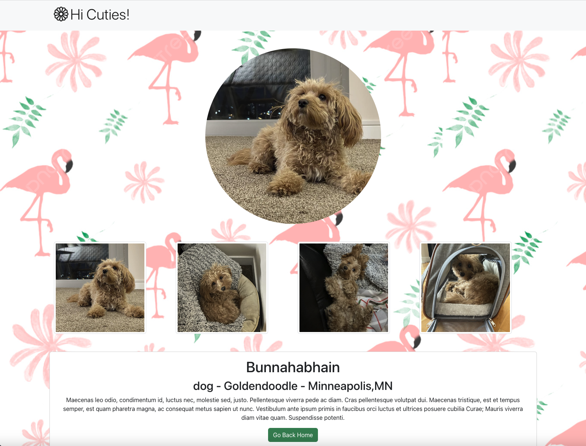

# Pet Photo Showcase Website

## Table of Contents

- [Pet Photo Showcase Website](#pet-photo-showcase-website)
  - [Table of Contents](#table-of-contents)
  - [Introduction](#introduction)
  - [Online demo](#online-demo)
  - [Features](#features)
  - [Getting Started](#getting-started)
  - [Technologies Used](#technologies-used)
  - [Contributing](#contributing)

## Introduction

This project is a pet photo showcase website built with React. The website aims to provide users with a delightful experience as they explore the wonderful world of pets through captivating photos and essential information about each pet. Whether you are an animal lover or looking for your next furry companion, our website is the perfect place to find adorable pet pictures.

## Online demo

https://blingblingda.github.io/hi-cuties




## Features

- Browse through a collection of high-quality and adorable pet photos.
- View basic information about each pet, including their name, breed, and a short description of their personality.
- Intuitive and user-friendly interface, making it easy to navigate and explore the website.
- Responsive design, ensuring a seamless experience on various devices, including desktops, tablets, and smartphones.

## Getting Started

To run the project locally on your machine, follow these steps:

1. **Clone the repository:**

```
git clone https://github.com/blingblingda/hi-cuties.git
cd hi-cuties
```

2. **Install dependencies:**

```
npm install
```

3. **Start the development server:**

```
npm start
```

4. **Open the application:** Visit `http://localhost:3000` in your web browser to see the website in action.

## Technologies Used

The following technologies and tools were used to develop this project:

- React: A JavaScript library for building user interfaces.
- HTML5: The markup language used for structuring the website.
- CSS3: The style sheet language used for designing the website's layout and appearance.

## Contributing

I welcome contributions to improve the pet photo showcase website. If you want to contribute, please follow these steps:

1. Fork the repository to your own GitHub account.
2. Create a new branch from the main branch: `git checkout -b feature/your-feature-name`.
3. Make your changes and commit them with descriptive commit messages.
4. Push your changes to your forked repository.
5. Submit a pull request detailing the changes you made and explaining their purpose.

I will review your pull request and merge it into the main branch if it aligns with the project's goals.
